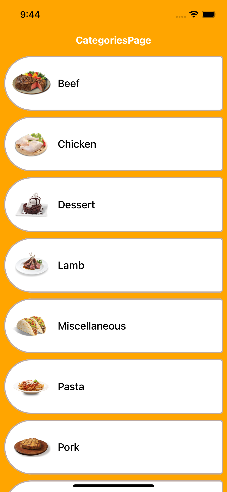
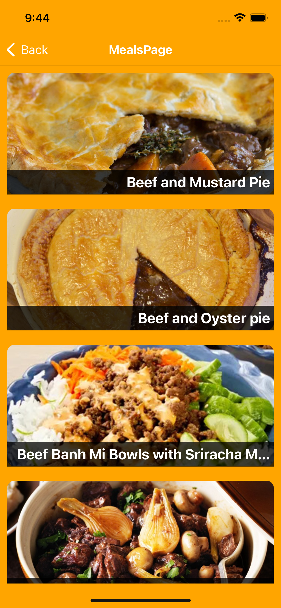

# Tarifka
Tarifka app for React-Native course on [Patika](https://app.patika.dev)

# Here images of Application

    

# Tools & Resources

- [TheMealDB](https://www.themealdb.com/api.php)
- [Lottie](https://github.com/lottie-react-native/lottie-react-native) for animation
- [React Navigation](https://reactnavigation.org/) for page hierarchy
- [.env](https://github.com/motdotla/dotenv)
- [Axios](https://github.com/axios/axios) for data fetching.

# 